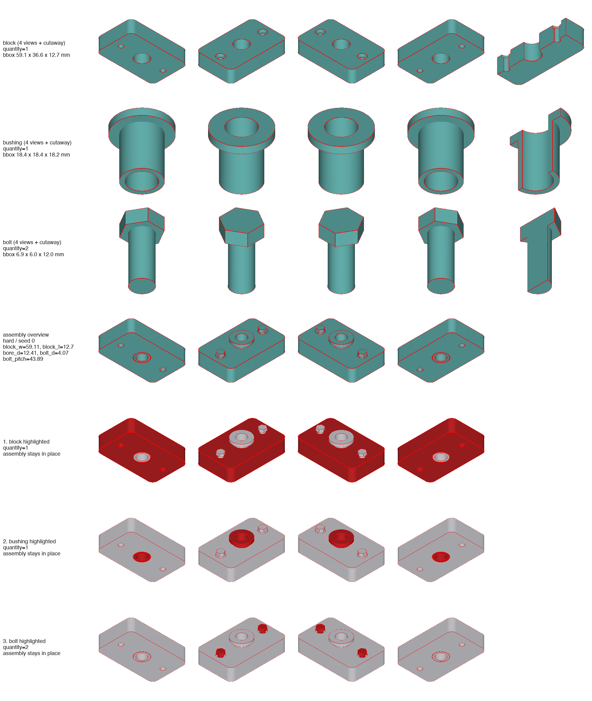

# The Design Interface (part + spec)

A BenchCAD 2.0 family is one directory with two source files — the **part** you
draw, and the **spec** that varies it across the benchmark:

```
designs/<family>/
├── part.py       # the parametric part — a human writes this: build(<named params>)
├── spec.py       # the benchmark generator — PARAM_SPEC, check(), optional refine()
└── family.json   # labels: family, standard, base_plane, description, contributor
```

The split is deliberate. `part.py` reads like a part a person authored — named
parameters, ordinary CadQuery, no dictionaries and no code generation. `spec.py`
holds the machinery that turns one part into a difficulty-graded family; **the
framework does the sampling**, so you never hand-write a generator loop. The
reference implementations are
[`designs/example_tee_bracket/`](../designs/example_tee_bracket/) (no coupling)
and [`designs/simplex_sprocket/`](../designs/simplex_sprocket/) (table-driven +
coupled).

---

## `part.py` — `build(<named params>) -> cq.Workplane`

Write **plain parametric CadQuery**: named arguments, build the solid, bind it
to `result`, return it. This is the file a human reads.

```python
import cadquery as cq
import math
from bench2.geomlib import sprocket_profile     # shared curves — call them directly

def build(pitch, roller_d, tooth_width, n_teeth, bore_d, form_b=0):
    pts = sprocket_profile(n_teeth, pitch, roller_d)
    result = cq.Workplane("XY").polyline(pts).close().extrude(tooth_width)
    if form_b:                                   # branch on a feature param directly
        result = result.faces(">Z").workplane().circle(bore_d).extrude(tooth_width)
    result = result.faces(">Z").workplane().hole(bore_d)
    return result
```

You never format numbers into strings or emit code. For a concrete instance
`bench2` **derives** the stand-alone program a model is asked to produce
(`framework/bench2/derive.py`): each `build()` argument becomes a flat module
global (`n_teeth = 17`), and every helper the body calls — a geomlib curve, one
of your own `_local` functions, a module constant — is inlined, so the emitted
program imports only `cadquery` + `math`. The derivation is a pure text
transform (same params in ⇒ byte-identical program out), and `bench2 validate`
proves the derived program executes to the *same* solid as calling `build()`
directly — the final coding is machine-guaranteed consistent.

Rules:
- **named parameters** — every argument must be declared in `spec.py`'s `PARAM_SPEC`
- bind `result`; use only `cq` / `math` / geomlib helpers / your own module-level
  `_helpers` and constants (no I/O, no randomness, no other imports)
- deterministic: same arguments ⇒ same geometry, in the pinned environment
  (`cadquery==2.3.0`)
- `result` is a single non-degenerate solid **or**, for an assembly family, a
  named `cq.Assembly` (folded to a compound on export). Every body must be a
  real, non-degenerate solid; an assembly family declares its body count with
  `"solids"` in `family.json` so a silently-vanished member is caught
- a heterogeneous family branches on a `feature` param (`if form_b: …`) in
  ordinary `if`/`else` — the derived program keeps the branch, evaluated against
  that instance's values

---

## `spec.py` — the benchmark generator

### 1. `PARAM_SPEC: dict[str, dict]`

One entry per `build()` parameter. `desc/unit/range/source` are always
required; the remaining keys tell the framework **how to draw** the value:

| key | required | meaning |
|---|---|---|
| `desc` | ✓ | what the parameter physically is |
| `unit` | ✓ | `"mm"`, `"deg"`, `""` (counts/ratios) |
| `range` | ✓ | `{"easy": (lo, hi), "medium": (lo, hi), "hard": (lo, hi)}` — the contract every sampled value must satisfy; may widen with difficulty |
| `source` | ✓ | where the range comes from: a standard table (`"ISO 4014"`), an engineering rule, or `"proportion"` |
| `integer` | – | draw as an integer in `range` (default is a float, 2 dp) |
| `choices` | – | draw from a discrete set — `[0, 2, 4]`, or per-difficulty `{"easy": [0], "hard": [2, 4]}` |
| `refine` | – | **not drawn** by the framework — computed in `refine()` (a coupled parameter). Still declares a `range` for the contract |
| `feature` | – | `True` if it toggles an optional feature (drives edit derivation) |
| `coverage` | – | list of values sampling **must** be able to produce (e.g. every pitch row of the table); the validator fails if any never appears in ~120 draws |

Difficulty semantics: **easy** = core geometry, features off, tight ranges.
**medium** = features on, wider ranges. **hard** = all features, extreme-but-
valid ranges that exercise the constraint boundary.

### 2. `check(p: dict) -> list[str]`

Returns the list of violated constraints (empty = valid). This is the
engineering heart of the contribution and **the main thing humans review**.
Every constraint carries its reason — cite the rule or standard:

```python
def check(p):
    bad = []
    if p["web_t"] > p["web_h"] / 4:              # plate-like, not a block
        bad.append("web_t > web_h/4: web must be plate-like (structural convention)")
    return bad
```

The framework calls `check()` on every draw and rejects failures — you write the
constraints, not the loop.

### 3. `refine(p, difficulty, rng) -> None`  *(optional)*

Only needed when parameters are **coupled** — one value computed from others (a
bore bounded by a root circle, a hub sized off the bore) or drawn jointly (a
real table row, not free numbers). The framework draws every non-`refine`
parameter first, then calls `refine()` to fill the `refine=True` ones **in
place**. Write just the coupling — no rejection loop:

```python
from bench2 import Resample

def refine(p, difficulty, rng):
    _, pitch, d1, b1 = _ISO606[int(rng.integers(len(_ISO606)))]   # one real chain row
    p["pitch"], p["roller_d"], p["tooth_width"] = pitch, d1, b1
    df = _root_circle(pitch, p["n_teeth"], d1)
    lo, hi = PARAM_SPEC["bore_d"]["range"][difficulty]
    p["bore_d"] = round(float(rng.uniform(max(lo, 0.2 * df), min(hi, 0.45 * df))), 1)
    if min(hi, 0.45 * df) <= max(lo, 0.2 * df):
        raise Resample          # this base draw admits no valid bore — resample
```

Use only `rng` for randomness (same seed ⇒ same parameters). Raise
`bench2.Resample` to discard an infeasible base draw; the framework resamples.
Families with no coupling (like `example_tee_bracket`) omit `refine()` entirely.

---

## `family.json`

```json
{
  "family": "tee_bracket",
  "standard": null,
  "base_plane": "XY",
  "description": "T-section mounting bracket: flange plate + central web, optional bolt holes.",
  "source": "structural-bracket proportions; AISC edge-distance rule for holes",
  "contributor": "your-github-handle"
}
```

`standard` is the anchoring spec (`"ISO 4014"`) or `null`; `base_plane` ∈
`XY|XZ|YZ` is the natural sketch plane. A family that calls geomlib helpers adds
`"geomlib": ["sprocket_profile", "keyway_dims"]`.

## Assembly families (`<name>_asm`)

A family whose real product is several parts returns a **named `cq.Assembly`**,
one node per real component — nothing is unioned across components, and nothing
overlaps:

```python
result = (cq.Assembly()
          .add(half_a, name="half_link_01")
          .add(half_b, name="half_link_02")
          .add(stud,   name="centre_stud")
          .add(pin,    name="taper_pin"))
```

Add the nodes in a **fixed order** (a literal sequence or a `for i in range(n)`
loop, never a set/dict iteration) — the derived program must stay
byte-identical per seed. `family.json` then declares what shipped:

```json
  "solids": 4,
  "components": [
    {"name": "half_link",   "quantity": 2, "role": "interlocking half link"},
    {"name": "centre_stud", "quantity": 1, "role": "keys both halves"},
    {"name": "taper_pin",   "quantity": 1, "role": "locks the joint"}
  ]
```

`solids` is the body count `validate` holds every instance to; `components` is
the BOM — one row per *distinct* component, `quantity` for repeats, summing to
`solids`.

**The naming contract.** Name every shape-bearing Assembly node either
**exactly** after its component (`centre_stud` — the quantity-1 case) or
`<component>_<NN>` for repeated instances (`half_link_01`, `half_link_02`). An
exact declared name wins over suffix stripping; any other name fails. Keep
semantically distinct components separate even when their geometry happens to
match — two pins with different roles are `left_pin`/`right_pin` (two declared
components), not `pin_01`/`pin_02`.

A quantity may instead be the **name of an integer build parameter** when the
instance count is itself a catalog value — a bearing's ball complement, a
chain's link count:

```json
  "components": [
    {"name": "outer_ring", "quantity": 1},
    {"name": "inner_ring", "quantity": 1},
    {"name": "ball", "quantity": "ball_count"}
  ]
```

Such a family **omits `solids`** (the body count is instance-dependent); the
referenced parameter must exist in `PARAM_SPEC` with `integer: true`, and every
sampled instance is checked against the resolved quantity sum.

What `bench2 validate` enforces on every sampled instance, from the exported
STEP (not from the in-process shape — a body can build fine and still export
inside-out):

- **body count** equals `"solids"` (or the resolved BOM) — catches a component
  that a boolean ate, and two components that silently fused;
- **every body is a sane solid** — positive volume and `BRepCheck`-valid;
- **no two bodies share volume** — an assembly never merges its members, so
  interpenetrating parts look perfectly normal in a render and in the STEP.
  Coincident faces are fine (a bolt head bearing on a flange); shared *volume*
  is not.

Component evidence has its own command — see
[Assembly component previews](#assembly-component-previews-bench2-preview-parts)
below. Mating dimensions belong in `check()` like any other constraint — a
clearance that only exists inside `part.py` is invisible to review.

## Shared standards: `bench2.geomlib` (don't copy-paste tooth math)

Reusable curve generators and standard tables (sprocket tooth profile, gear
involute, DIN 6885 keyway seat, …) live in `framework/bench2/geomlib/`. Import
and **call them directly** — in both `build()` (part.py) and any constraint
(spec.py). The deriver inlines the helper's source into each emitted program, so
it stays stand-alone (only `math` + `cadquery`):

```python
from bench2.geomlib import keyway_dims

def build(..., bore_d, has_keyway=0):
    if has_keyway:
        kw, kd = keyway_dims(bore_d)             # DIN 6885 seat — inlined on derive
        ...
```

- Declare what you use in `family.json`: `"geomlib": ["keyway_dims"]`. `bench2
  validate` checks the names against the registry and confirms they are inlined.
- A geomlib helper must be **self-contained** (only `math`/builtins, no module
  state, deterministic) so it runs verbatim inside an emitted program.
- Need a curve that doesn't exist yet? Add it to `geomlib/` in the same PR — the
  next family gets it for free.

**Part-specific** helper shared between `build()` and `check()` (a hole layout
used by both)? Put it in `part.py` and import it in `spec.py` with
`from part import _hole_layout` — spec may depend on the part, never the reverse.
One definition keeps build and check from drifting.

## Heterogeneous variants inside one family

Catalogs ship the same part in several forms (norelem 22250: Form A disc-with-
boss vs Form B barrel hub). Model them as ONE family with a `feature`-flagged
discrete parameter (`form_b: 0/1`, drawn via `choices`), branch in `build()`,
and give each variant its own constraints in `check()` (Form B legitimately
allows bores to 0.58·df where Form A stops at 0.50·df).

## What you do NOT write

No sampling loop (the framework samples from `PARAM_SPEC`), and no edit
pairs — those are derived downstream (`feature` params drive add/remove
edits). Your jobs are `part.py`, `spec.py`, and `family.json`.

## Machine gates (`bench2 validate`, same in CI)

1. `family.json` keys present and valid
2. `part.py:build` + `spec.py:PARAM_SPEC/check` exist; every `build()` parameter
   is declared in `PARAM_SPEC`
3. per difficulty × N seeds: the sampler draws params that pass `check`, the
   sampled value stays inside its declared `range` (the contract), and the
   derived program executes to a non-degenerate solid — plus, on the exported
   STEP: every body has positive volume and passes `BRepCheck`, the body count
   matches `family.json` `"solids"`, and no two bodies overlap (assemblies)
4. determinism: same seed ⇒ byte-identical derived program
5. difficulty separation: the three difficulties don't produce identical programs
6. geometry-hash report: duplicate rate within the sample batch
7. coverage: every value in a `coverage=[...]` list appears across a 120-draw pass
8. geomlib: declared helpers exist in the registry and are inlined in the program

`bench2 preview <family>` renders four PNGs: `preview.png` (difficulty × seed
overview), `preview_views.png` (the four diagonal benchmark views — what the
model sees), `preview_hard_zoom.png` (front/side/top/iso three-view of a hard
example plus a half-section cutaway — the axis-aligned views the diagonal isos
hide), and `preview_extremes.png` (smallest & largest sampled draw — acceptance
evidence that both ends of your declared ranges produce sane geometry).

## Assembly component previews (`bench2 preview-parts`)

The STEP export path folds an assembly into a compound — component names and
hierarchy never reach the renderer — so component evidence has its own command:

```bash
uv run bench2 preview-parts <family>     # -> designs/<family>/preview_parts.png
```

It re-executes the derived stand-alone program for the deterministic
**hard / seed 0** instance with an export harness that keeps the assembly tree
(one STEP per shape-bearing node plus its absolute world transform), then
renders the components as separate actors — the full pose and every
parent/child `Location` transform survive. The grid shows, in `family.json`
`components` order:

1. one row per semantic component — its raw local shape in the four bench
   views in its own frame plus a half-section CUTAWAY panel (a purely internal
   concavity — a bearing ring's raceway, a thread, a circlip groove — is
   invisible in every opaque exterior view), labeled with the component's
   bounding box in mm;
2. the complete assembly in its true pose, labeled with the instance's
   parameters;
3. one red-on-gray highlight row per component (correct depth occlusion, the
   rest of the assembly stays in place). Repeated instances highlight together
   with `quantity=N` by default; `--per-instance` renders one row per instance
   (`half_link_01`, `half_link_02`, …) instead, and `--transparent` ghosts the
   non-highlighted components (see-through) so an internal component — a
   bushing pressed into its bore, a bolt shank inside its hole — stays visible
   when highlighted.

`bench2 preview` runs the same render automatically when `build()` returns a
named assembly; single-part families are unaffected. Component order and image
bytes are deterministic in the pinned environment. The command **fails clearly
instead of producing a misleading image** when `result` is not a named
assembly, an instance matches no declared component, instance names collide, or
quantities drift from the declaration. The previous `preview_parts.png` is
removed before every run, so a failed run never leaves a stale image behind as
evidence.

A complete runnable example — three semantic components, a repeated
`bolt_01`/`bolt_02` pair, a nested and rotated sub-assembly — lives in
[`docs/examples/preview_parts_demo/`](examples/preview_parts_demo/) with the
grouped, [per-instance](examples/preview_parts_demo/preview_parts_per_instance.png),
and [transparent](examples/preview_parts_demo/preview_parts_transparent.png)
artifacts committed (a framework test keeps it runnable). The grouped default
looks like this:


