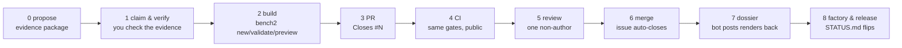

# Tutorial: your first family, end to end (with pictures)

*Chinese: [WALKTHROUGH.zh.md](WALKTHROUGH.zh.md)*

Everything below is real: the issues, the images, the code and the CI runs all
exist in this repo. Follow along with your own part — same stations, same
commands. Time budget for a first family: **one evening**.

## What you'll build

A *parametric design*: two small Python files — the part and its spec — that
generate every size of one catalog part, with engineering constraints a
machinist would agree with.
The benchmark then renders your part like this — four diagonal views, three
difficulty tiers:


## The lifecycle at a glance



Bots handle the arrows; humans only propose, verify, build, review.

## Station 0 — propose (or pick) an issue

Every family starts from a **real source**. The issue must carry the three-piece
evidence package — here's what a complete one looks like
([issue #1](../../../issues/1), the duplex sprocket):

| Product photo (catalog) | Dimensioned drawing (datasheet) |
|---|---|
|  |  |

1. **anchoring standard/catalog link** — norelem 22253, DIN ISO 606
2. **dimensioned drawing** — the symbols (D, D1, B1, B2, L…) become your parameter names
3. **dimension table with min & max rows** — z = 9 … 95, so review can check both ends

Don't want to invent one? **Pick from the wanted lists** — every `[category]`
issue carries a table of ~25–50 part families with verified anchors
([roadmap #21](../../../issues/21) links them all). The welcome bot
auto-checks your name against [`registry.json`](../registry.json) (600+ known
names) the moment you open the issue.

## Station 1 — claim it, then verify it (5 minutes)

Self-assign, then run the check in
[CONTRIBUTING.md](../CONTRIBUTING.md#claiming-an-issue--you-verify-it) — link
alive, drawing has symbols, table has min/max, **recompute two numbers**.
For the sprocket: the table says D1 = 46,42 at z = 9; the standard says
D1 = p / sin(π/z) = 15.875 / sin(20°) = **46.415** ✓. If a spot-check fails,
label `needs-evidence` and say what's wrong — that comment is itself a
credited contribution.

## Station 2 — build

```bash
uv sync                              # once
uv run bench2 new my_family          # scaffolds designs/my_family/
```

Fill the two files (spec: [DESIGN_SPEC.md](DESIGN_SPEC.md); copy the shape of
[`designs/simplex_sprocket/`](../designs/simplex_sprocket/)):

| Piece | What it is | The sprocket example |
|---|---|---|
| `build(...)` (part.py) | named parameters → the solid, plain CadQuery | calls `sprocket_profile(...)` directly; the tool derives the stand-alone program, inlining the helper |
| `PARAM_SPEC` (spec.py) | every parameter: unit, per-difficulty range, **source** | `pitch` cites "ISO 606 Table 1", declares `coverage=[8.0, …, 25.4]` |
| `check(p)` (spec.py) | inter-parameter constraints, each with its reason | `bore_d > 0.5·df → "tooth rim too thin"` |
| `refine(p, difficulty, rng)` (spec.py, optional) | fills coupled params after the base draw — the framework samples | picks an ISO 606 chain **row**, not free numbers; sizes the bore off the root circle |

Table-driven parts keep a `NOTES.md` mapping datasheet symbols → formulas →
parameters ([example](../designs/simplex_sprocket/NOTES.md)) — reviewers
verify equations against it, layer by layer.

Iterate until the gates pass:

```
$ uv run bench2 validate my_family
  ✓ family.json: keys + base_plane valid
  ✓ PARAM_SPEC: 9 params, all entries complete
  ✓ easy/medium/hard: 4/4 seeds sample+check+build+execute clean
  ✓ coverage: pitch reaches all 6 declared values
  ✓ geomlib: ['sprocket_profile'] registered + inlined
  ✓ difficulty separation · geometry novelty 12/12 unique
PASS — designs/my_family
```

Then **look at your part before anyone else does**:

```bash
uv run bench2 preview my_family      # writes three PNGs
```

| `preview.png` — difficulty × seed grid | `preview_extremes.png` — smallest & largest draw |
|---|---|
|  |  |

Hold the extremes against the table's min/max rows yourself: does the small
end still have sane proportions, does the big end still render every feature?
That's exactly what your reviewer will do.

**Want to rotate it, section it, and tweak parameters live?** Build the part and
open it in a 3D viewer with one command:

```bash
uv run python tools/debug_family.py my_family              # samples a valid instance
uv run python tools/debug_family.py my_family --diff hard  # or a specific tier
```

See **[DEBUGGING.md](DEBUGGING.md)** — the ocp-vscode viewer, the CQ-editor
edit-and-see-live loop, and how to debug a family you're hand-writing.

## Stations 3–5 — PR, CI, review

Open **one PR touching only `designs/my_family/`** with `Closes #<issue>` in
the description — CI *enforces* the link, then re-runs the same validate gates
publicly. One non-author reviews per [REVIEWING.md](REVIEWING.md) and
approves with a three-line verdict:

```
views ✓ (against the 22253 drawing)
equations ✓ (recomputed D1 @ z=17; pt column vs Renold table)
constraints ✓ (bore/groove wall rule is sound)
```

## Stations 6–8 — everything after merge is automatic

The instant your PR merges: the issue closes, the category checklist ticks,
and the dossier bot posts the acceptance renders **back onto your issue**, so
it reads end-to-end — proposal evidence at the top, final geometry at the
bottom ([see it live on #22](../../../issues/22)). The provenance board
[CONTRIBUTORS.md](CONTRIBUTORS.md) regenerates with your name in the
*Implemented* column — that row is the paper-authorship record. Release
qualification happens per batch in the private factory;
[STATUS.md](STATUS.md) shows your family move MERGED → GENERATED →
QUALIFIED → RELEASED.

## FAQ

- **`uv sync` fails / no Python?** → the zero-code path still works: post the
  datasheet + table on an issue (*Part proposal* form), a maintainer builds it,
  both of you are credited.
- **My preview doesn't look like the drawing.** → fix before PR; the #1 review
  rejection cause is geometry-vs-drawing mismatch. Open the part in a 3D
  viewer to see what's off — **[DEBUGGING.md](DEBUGGING.md)** (`tools/debug_family.py`).
- **`validate` says a sampled value left the declared range.** → the framework
  samples from `PARAM_SPEC`, so the declared range is the contract: widen the
  range, or clamp a coupled value inside it in `refine()` (this gate caught a
  real bug in our own reference sprocket).
- **Question?** → [Discord](https://discord.gg/be9AtvrDyK), or comment on your
  issue.
