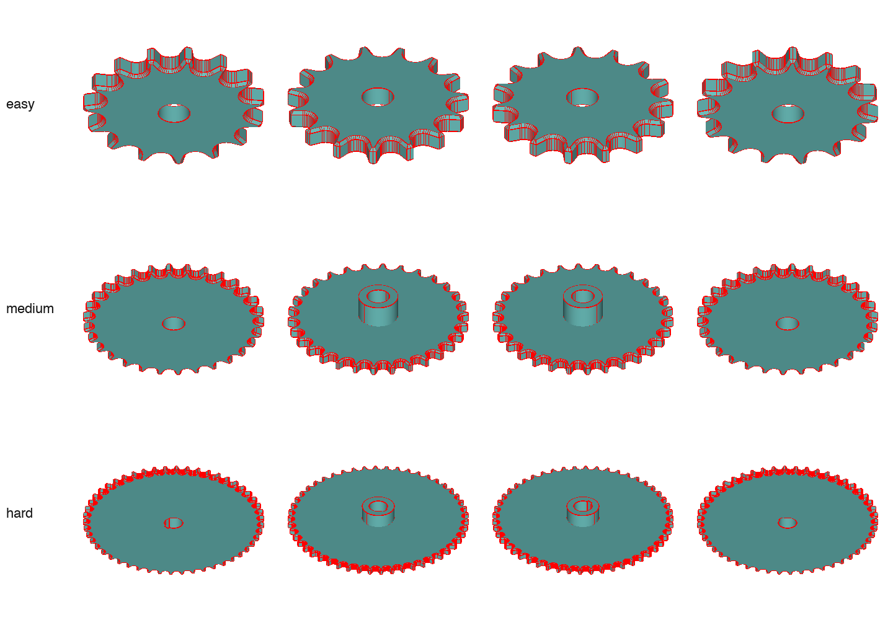
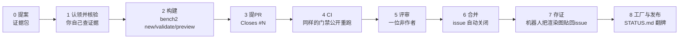
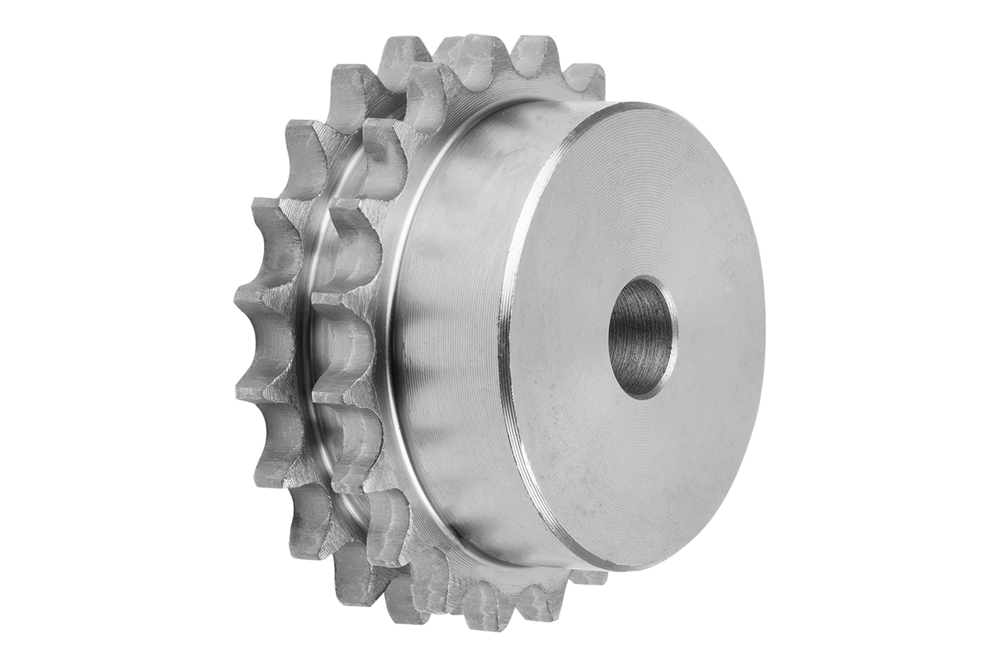
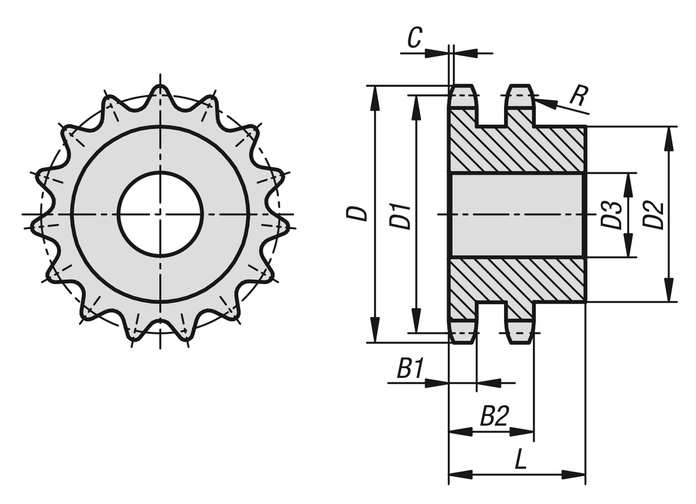
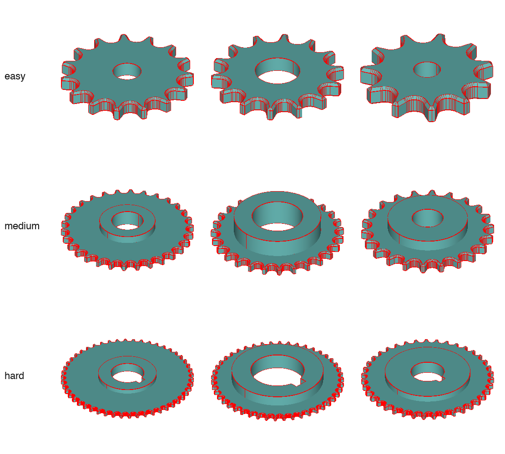
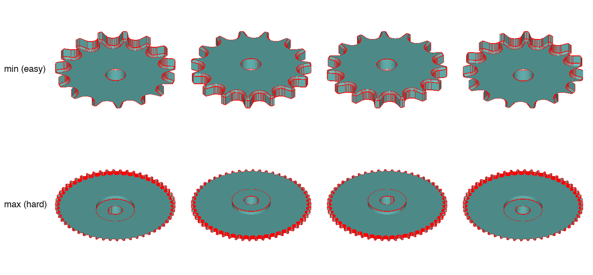

# 教程:从零到落库,做出你的第一个 family(图文版)

*English: [WALKTHROUGH.md](WALKTHROUGH.md)*

下面所有内容都是真实的:issue、图片、代码、CI 全都在这个仓库里。拿你自己的
零件照着走一遍即可——同样的站点、同样的命令。第一个 family 的时间预算:
**一个晚上**。

## 你要做出什么

一个*参数化设计*:两个小 Python 文件(零件本体和它的 spec),就能生成某个
目录零件的所有尺寸,并带着机械师会认可的工程约束。benchmark 会把你的零件渲染成这样——四个对角视角、
三档难度:



## 全流程一张图



箭头全是机器人负责;人只做四件事:提案、核验、构建、评审。

## 第 0 站——提案(或直接挑一个现成 issue)

每个 family 都从**真实来源**出发。issue 必须带三件套证据包——完整示例长这样
([issue #1](../../../issues/1),双排链轮):

| 产品照片(目录) | 带尺寸符号的工程图(datasheet) |
|---|---|
|  |  |

1. **锚定标准/目录链接** —— norelem 22253,DIN ISO 606
2. **带尺寸符号的工程图** —— 图上的符号(D、D1、B1、B2、L…)就是你的参数名
3. **含最小/最大行的尺寸表** —— z = 9…95,评审要对照两端

不想自己想题目?**直接从 wanted 清单里挑**——每个 `[category]` issue 里都有
25–50 个带核验锚的备选零件([路线图 #21](../../../issues/21) 全部链接)。
你一开 issue,迎新机器人就会自动拿名字去查
[`registry.json`](../registry.json)(600+ 已知名字)防撞名。

## 第 1 站——认领,然后自己核验(5 分钟)

Self-assign 之后,先跑
[CONTRIBUTING.md](../CONTRIBUTING.md) 里的核验清单——链接活着、图有符号、
表有最小/最大行、**亲手重算两个数**。以链轮为例:表里 z=9 时 D1=46,42;
标准公式 D1 = p/sin(π/z) = 15.875/sin(20°) = **46.415** ✓。抽查不过就打
`needs-evidence` 标签并说明缺什么——这条评论本身就记入贡献。

## 第 2 站——构建

```bash
uv sync                              # 只需一次
uv run bench2 new my_family          # 生成 designs/my_family/ 骨架
```

填两个文件(接口规格:[DESIGN_SPEC.md](DESIGN_SPEC.md);
照抄 [`designs/simplex_sprocket/`](../designs/simplex_sprocket/)
的形状):

| 件 | 是什么 | 链轮里的例子 |
|---|---|---|
| `build(...)`(part.py) | 具名参数 → 实体,普通 CadQuery | 直接调用 `sprocket_profile(...)`;工具会派生出独立程序并内联该 helper |
| `PARAM_SPEC`(spec.py) | 每个参数:单位、分难度范围、**来源** | `pitch` 引 "ISO 606 Table 1",声明 `coverage=[8.0,…,25.4]` |
| `check(p)`(spec.py) | 参数间工程约束,每条带理由 | `bore_d > 0.5·df → "齿圈壁太薄"` |
| `refine(p, difficulty, rng)`(spec.py,可选) | 在框架抽完基础参数后填耦合参数——抽样由框架完成 | 抽 ISO 606 链号**整行**而非自由数字;并按齿根圆定出 bore |

表驱动的零件要配 `NOTES.md`:datasheet 符号 → 公式 → 参数的映射表
([示例](../designs/simplex_sprocket/NOTES.md))——评审就是拿它逐层核方程的。

迭代直到门禁全过:

```
$ uv run bench2 validate my_family
  ✓ family.json: keys + base_plane valid
  ✓ PARAM_SPEC: 9 params, all entries complete
  ✓ easy/medium/hard: 4/4 seeds sample+check+build+execute clean
  ✓ coverage: pitch reaches all 6 declared values
  ✓ geomlib: ['sprocket_profile'] registered + inlined
  ✓ difficulty separation · geometry novelty 12/12 unique
PASS — designs/my_family
```

然后**在任何人之前先自己看图**:

```bash
uv run bench2 preview my_family      # 输出三张 PNG
```

| `preview.png` —— 难度×种子九宫格 | `preview_extremes.png` —— 最小与最大抽样 |
|---|---|
|  |  |

自己先把极值图对着尺寸表的最小/最大行看一遍:小端比例还合理吗?大端每个
特征还在吗?——评审者做的就是这件事。

**想转着看、剖开看、边改参数边看?** 一条命令构建 + 在 3D viewer 里打开:

```bash
uv run python tools/debug_family.py my_family              # 抽一个合法实例
uv run python tools/debug_family.py my_family --diff hard  # 或指定难度
```

见 **[DEBUGGING.md](DEBUGGING.md)** —— ocp-vscode viewer、CQ-editor 边改边看的循环,以及手写 family 时怎么调试。

## 第 3–5 站——PR、CI、评审

开**一个只动 `designs/my_family/` 的 PR**,描述里写 `Closes #<issue编号>`
——CI 会*强制*检查这个链接,然后公开重跑同样的 validate 门禁。一位非作者按
[REVIEWING.md](REVIEWING.md) 评审,用三行结论 approve:

```
views ✓ (对照 22253 工程图)
equations ✓ (重算了 z=17 的 D1;pt 列对过 Renold 表)
constraints ✓ (孔径/槽壁规则成立)
```

## 第 6–8 站——合并之后全自动

PR 合并的那一刻:issue 自动关闭、分类清单自动打勾、存证机器人把验收渲染图
**贴回你的 issue**——整个 issue 从头读到尾就是完整档案:顶部是提案证据,底部
是最终几何([活例子看 #22](../../../issues/22))。贡献者台账
[CONTRIBUTORS.md](CONTRIBUTORS.md) 自动重生成,你的名字进 *Implemented*
列——这一行就是论文署名的依据。发布资格由私有工厂按批次判定;
[STATUS.md](STATUS.md) 上能看到你的 family 从 MERGED → GENERATED →
QUALIFIED → RELEASED 一路翻牌。

## 常见问题

- **`uv sync` 装不上 / 没有 Python?** → 走零代码路径:把 datasheet + 尺寸表
  发到 issue(*Part proposal* 表单),维护者来写代码,两个人都记贡献。
- **装配零件 validate 报实体数不符 / 实体重叠。** → `family.json` 的
  `"solids"` 要等于真实零件数(`"components"` 各 `quantity` 之和),而且
  `makeCompound` 不会自动合并——两个零件共享体积在渲染里看不出来,门禁会
  拦下。贴合面重合没问题,共享**体积**不行。
- **preview 和工程图长得不像。** → PR 前先修好;评审打回的第一大原因就是
  几何与图纸不符。用 3D viewer
  打开零件看哪里不对——**[DEBUGGING.md](DEBUGGING.md)**(`tools/debug_family.py`)。
- **validate 报"抽样值超出声明范围"。** → 抽样由框架从 `PARAM_SPEC` 完成,
  声明的范围就是契约:把范围放宽,或者若该值是耦合参数,就在 `refine()` 里
  把它夹进范围内(这道门禁在我们自己的参考链轮上就抓过一个真 bug)。
- **有问题?** → [Discord](https://discord.gg/be9AtvrDyK),或直接在你的
  issue 下评论。
